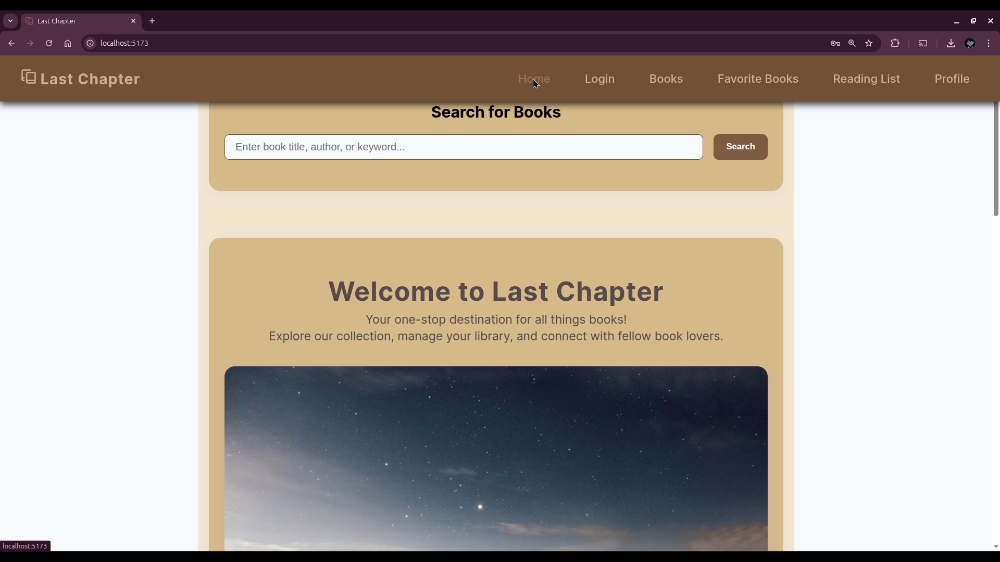
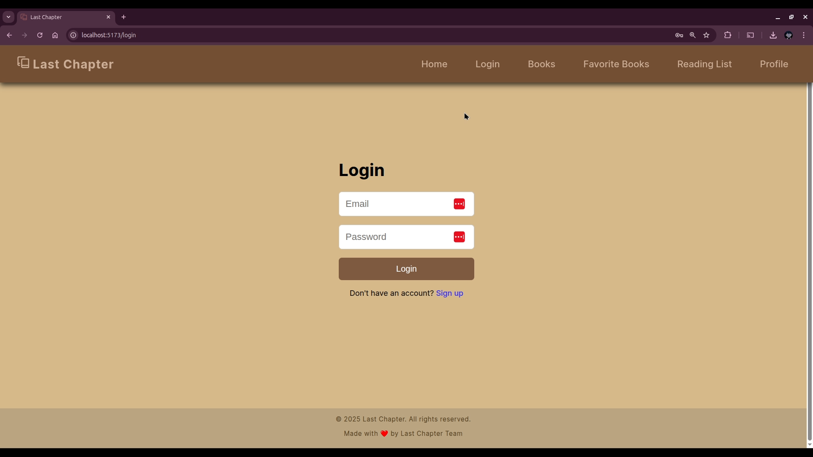
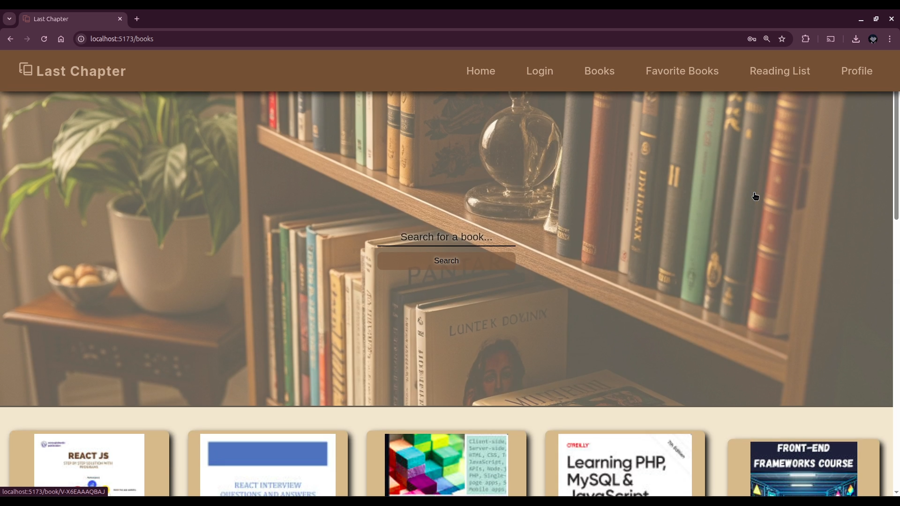
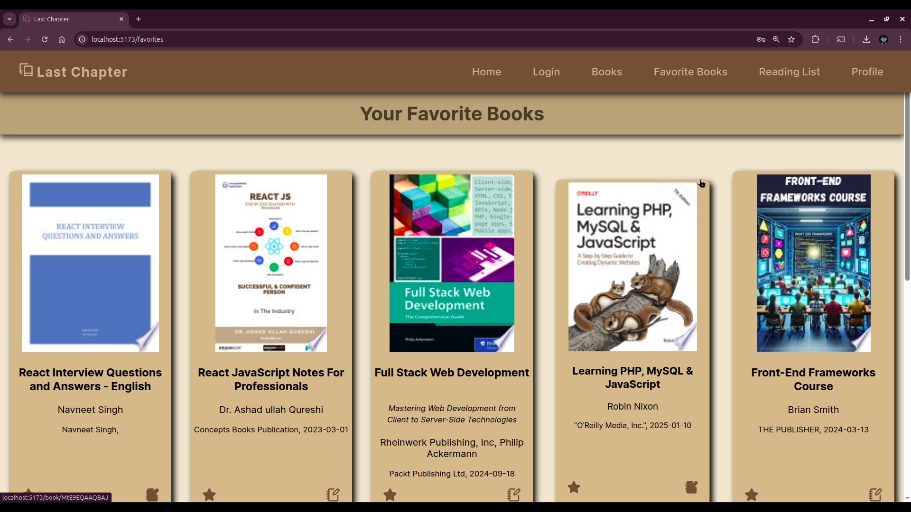
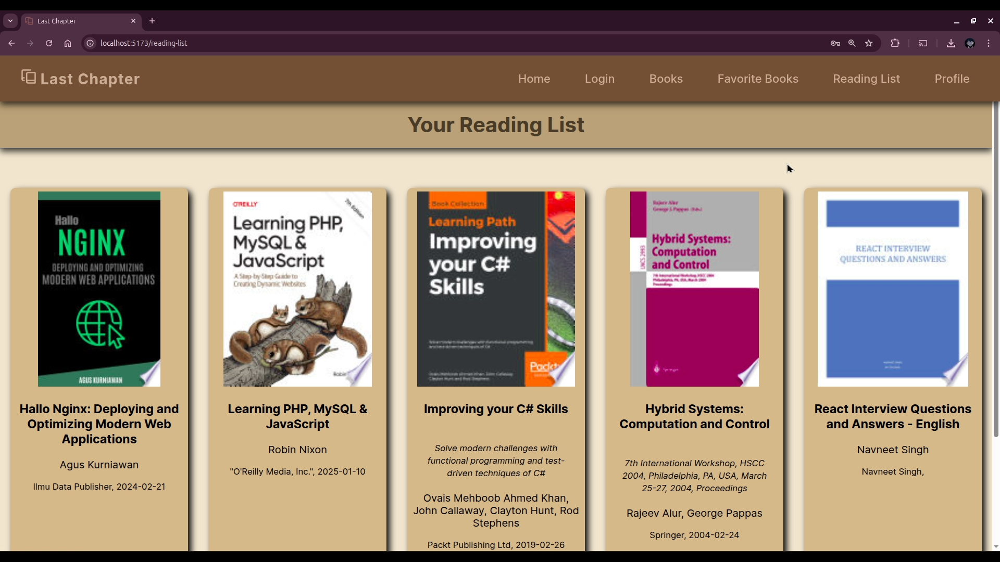
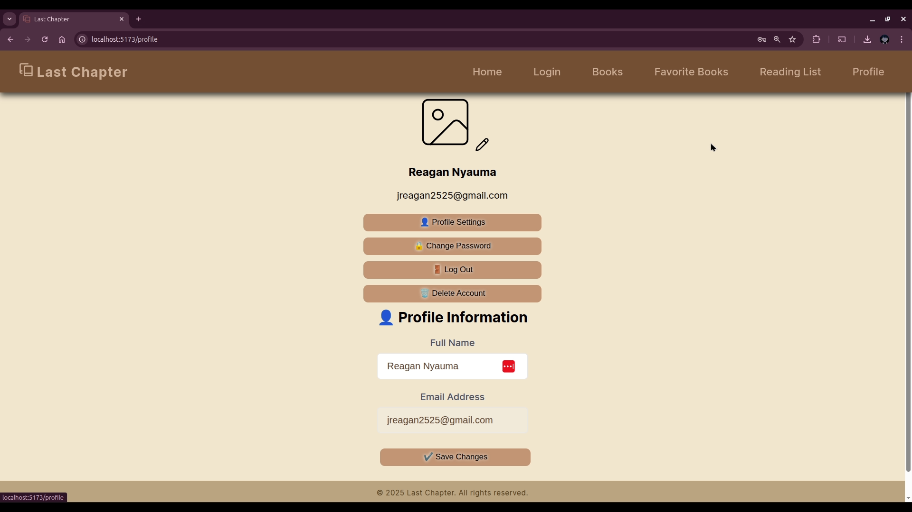

# Group 3 Project - Last Chapter

## Overview

Last Chapter is a React-based web application for book lovers. It allows users to search for books, manage favorites, create reading lists, and explore a wide collection using the Google Books API.

## Features

- Search for books by title, author, or keyword
- View book details and cover images
- Add or remove books from your favorites
- Create and manage a personal reading list
- Responsive design for desktop and mobile
- User-friendly interface

## Technologies Used

- React
- React Router
- CSS Modules
- Google Books API

## Getting Started

1. **Clone the repository:**
   ```sh
   git clone https://github.com/Moringa-SDF-PT10/group-03-project.git
   cd group-03-project
   ```

2. **Install dependencies:**
   ```sh
   npm install
   ```

3. **Start the development server:**
   ```sh
   npm run dev
   ```

4. **Open your browser:**
   Visit [http://localhost:5173](http://localhost:5173)


## Screenshots

- The Home page.



- The login page, which allows you to interact with the books.



- The Books page, where you can search for and interact with millions of books availed by Google Books API.



- The Favourites page, where you can see all the books that you love.



- The Reading List page, where you can see books that you'd love to read.



- The Profile page, where you can manage your account.


   
## Credits

Created by Group 3 for Moringa School SDF-PT10, End of Phase 2 Project.

---